# NICAR16LCC
Tipsheet for the Lonely Coder Presentation at NICAR 2016 in Denver

## Original Session Description: So You Want to Be a Lonely Coder?

How do you transition from a journalist who does data stuff sometimes to a full-fledged coder in your newsroom and what happens when you do? This session will help you take your data skills to the next level by giving you easy-to-replicate projects and newsroom tools that involve minimal coding and can be done in most locations and beats. Panelists will take you through some “easy wins” for your newsroom and discuss their experiences navigating newsrooms as the only coder in the room, as well as how to get buy-in from your boss and to convince higher-ups of the extra value in these types of projects.

## Goals:
The goal is to provide some concrete examples and starting points on how to get started in the world of data journalism from a dead stop. The audience should leave with some story ideas, easy-to-pick up tools and some notion of a plan that will take him from software-user to coding-journalist.

By Scott Pham, Brent Jones, Allie Kanik, and Lindsey Cook

# Intro
*By Scott Pham*

When I started out in data journalism, I felt a little lost. None of my immediate peers had any experience with data or code. It was hard to explain to others what I was trying to learn and do, and I didn't always have the tools or support I needed to do it.

I think that people who are learning data journalism on their own need to think hard about their strategy and their goals. Their newsroom may or may not be hospitable to data journalism and they need to find a way forward that works for their specific context.

A lonely coder needs to actively reach out for help and community because they aren't going to get it from their peers. We can't solve all (or most!) of these problems with a tipsheet, but what we can do is provide some projects to get started from zero.

If you are a lonely coder (or merely identify as one!) join the [Lonely Coders Club Slack group](http://lcc-slack.herokuapp.com/): or contact me at spham@cironline.org to get an invite. The group has more than a hundred coding journalists in newsrooms around the country. It's a good place to ask questions or show off some of your work.

*A note on code*: Not all data journalists code, but we've focused on coding because this tends to the be a big roadblock to solo data journalists. If you're on your own, your peers won't understand your code and might not get why its necessary or what it can do. These projects are designed to keep you productive and help you build on each success.

### Table of Contents:
- [CensusReporter.org](#census)
- [Interactive Tables](#tables)

# [CensusReporter.org](http://censusreporter.org)

*By Brent Jones*

First stop for exploring U.S. Census and American Community Survey data.
Can give you basic facts about a place very quickly.
Or be a starting place for a deeper story.

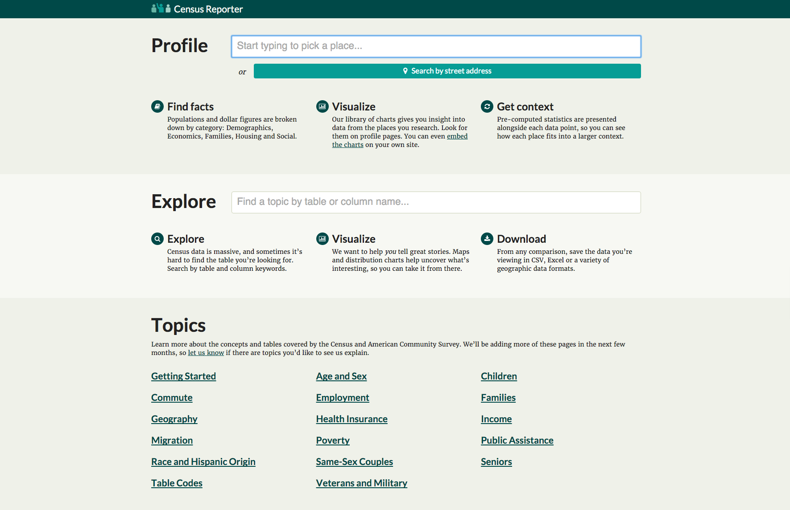

## Ways to explore:

* By place search
* By topic search
* Guided topics

## Guided Topics
Found on the homepage, these topics explain Census and ACS tables and provide direct links to CensusReporter summaries for many tables.

* [Getting Started](http://censusreporter.org/topics/getting-started/)
* [Table Codes](http://censusreporter.org/topics/table-codes/)
* [Geography](http://censusreporter.org/topics/geography/)

These three are an introduction to the rest. Getting Started is a basic overview of the data. Table Codes serves as sort of codebook for deciphering what the codenumbers mean. Geography explains how the Census breaks down and denotes geography within tables.

* [Age and Sex](http://censusreporter.org/topics/age-sex/)
* [Children](http://censusreporter.org/topics/children/)
* [Commute](http://censusreporter.org/topics/commute/)
* [Employment](http://censusreporter.org/topics/employment/)
* [Families](http://censusreporter.org/topics/families/)
* [Health Insurance](http://censusreporter.org/topics/health-insurance/)
* [Income](http://censusreporter.org/topics/income/)
* [Migration](http://censusreporter.org/topics/migration/)
* [Poverty](http://censusreporter.org/topics/poverty/)
* [Public Assistance](http://censusreporter.org/topics/public-assistance/)
* [Race and Hispanic Origin](http://censusreporter.org/topics/race-hispanic/)
* [Same-sex Couples](http://censusreporter.org/topics/same-sex/)
* [Seniors](http://censusreporter.org/topics/seniors/)
* [Veterans and Military](http://censusreporter.org/topics/veterans/)

The rest of these describe the topics in more detail as well as list many tables that pertain to the topic. They're a great way to get started if you're just exploring data.

## Topic Search

Also available from the homepage is topic search. You can start typing words relating to tables that you're interested in, and a dropdown list will show you what's available.

### What you get

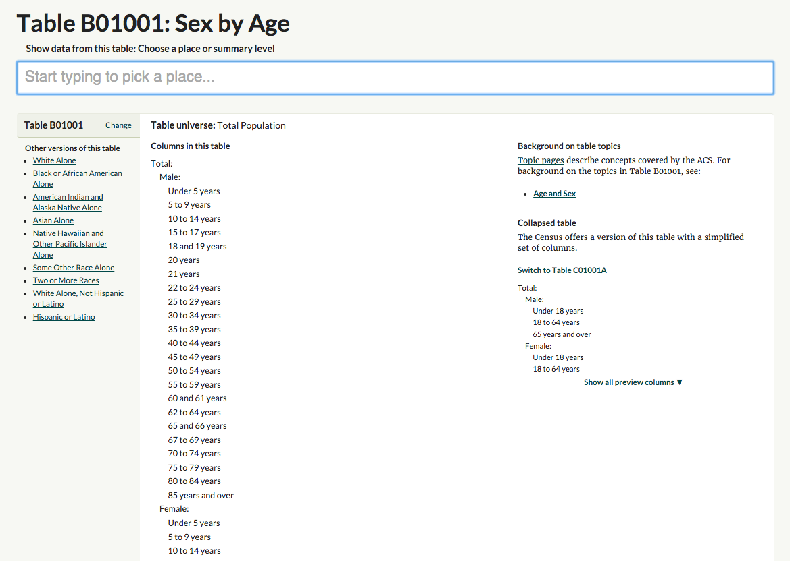

With either of these methods, you'll get a page describing the table. Helpfully, you'll get the universe of the table, to see who is included in the data. You'll also see the columns available. Off to the right are links to the topic pages that are relevant.

Most importantly, at the top is a box to pick the geographies you want to look at. You can either type a place name or a "summary level" — meaning a type of geography, like state, county, place, etc.

If you choose a summary level you'll also be asked to choose another, larger, summary level to filter the first choice by. An example: If you choose "places", you can then filter to choose places *in* Missouri, or places *in* St. Louis County.

#### The table view

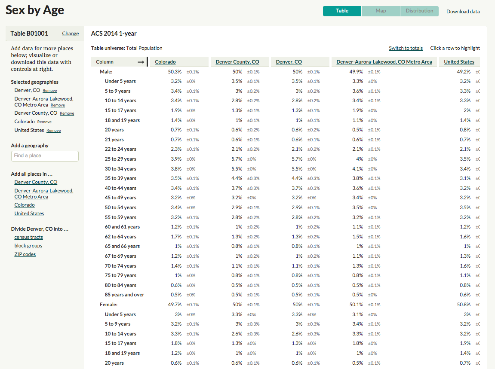

Once you've chosen your places and clicked through, you'll get a table. Here's its anatomy:

* At the top, you have the dataset used (usually ACS, with 1-, 3- or 5-year noted)
* Below that, the table universe.
* Across the top of the table, in columns, you have the geographies you selected.
* Down the sides, you have the "columns" of categories in the table.
* The data, with margins of error, are in the appropriate spots.

A few tools are available to you on this page. On the left you can change what geographies you're looking at. At the top right, you can download the data into various formats, including GeoJSON or shapefiles.

Finally, in the green buttons near the top, you can view the data in two other ways: A map or a distribution.

#### Map view

If you check out the map view, you'll see a choropleth map of the geography selected. Rolling over the geographies triggers a tooltip with the information selected, as well as the margin of error. An info box gives you the same basic data as the table view.

You want to be careful here, making sure that the column selected under "Show Column" in the info box is the column you think it is.

You can also change how your geography is divided, or change which geography you're looking at by clicking the Add More Places button.

#### Distribution view

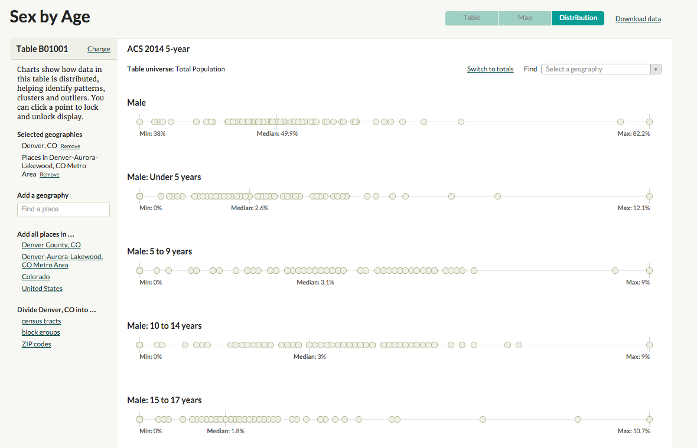

The distribution view is the final way to view the data. I found out that internally, some folks at Census Reporter call these "COAL" charts, for "circles-on-a-line".

You'll find the familiar bar at the left with options for changing the geography, and the data set used as well as the universe at the top.

For each column, there's a line with each geography represented as a circle. The Minimum, Median and Maximum are labeled. Rolling over the circles generates the tooltip, and you can click to lock the tooltip open, in order to compare more than one item.

## Place search

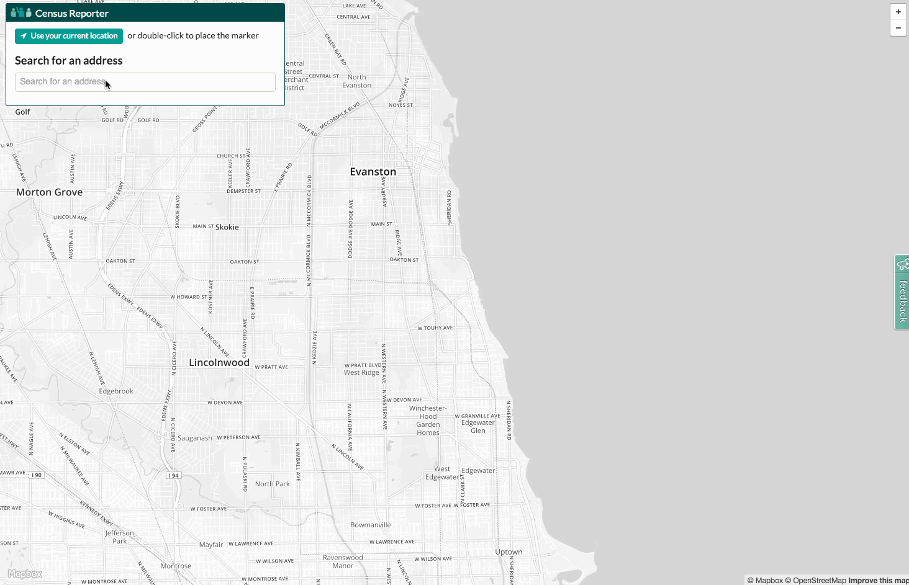

One simple way of using Census Reporter is by finding out information about a specific place. You can do this in the top search bar on the homepage, or the search bar in the top toolbar on most pages.

You can also click on the "search by address" button and let the site have access to your location (or just type in an address). This method lets you choose any of the geographies your address fits into: from block group to state, division or region.

Once you've chosen a place, you'll see a map at the top of the page showing the boundaries of the area. There's an info box with basic information about the place. Also important, the info box tells which data set is used.

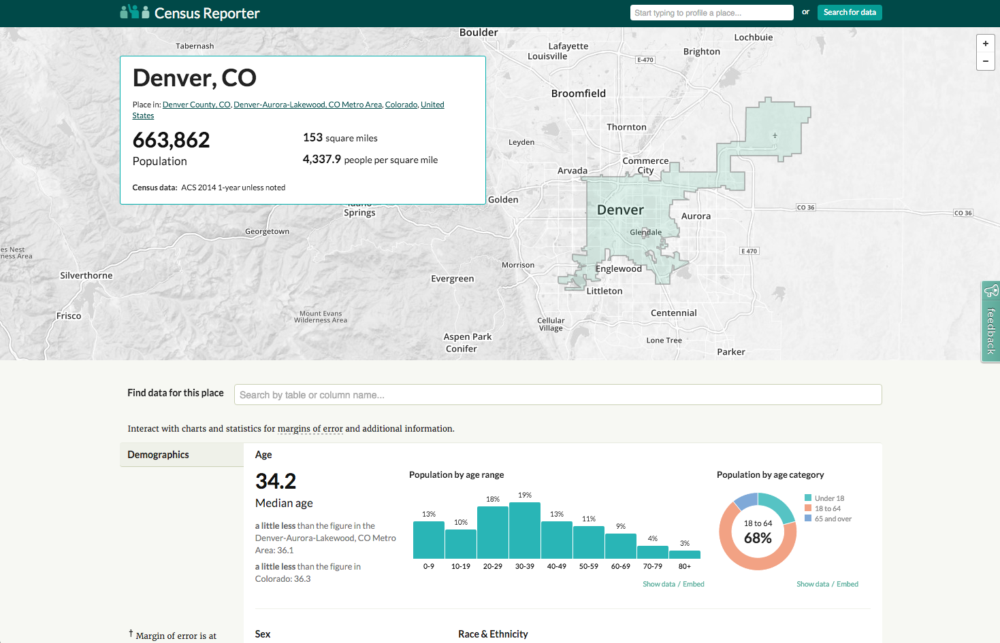

Below that, there's a box to jump to a specific table.

After that is a series of charts:

* Demographics
* Economics
* Families
* Housing
* Social

The charts note where the margins of error are large (and therefore where you should be careful using the data). You can roll over most areas on the charts to show more information.

The charts each have two links under them: Show data, and Embed.

### Show data

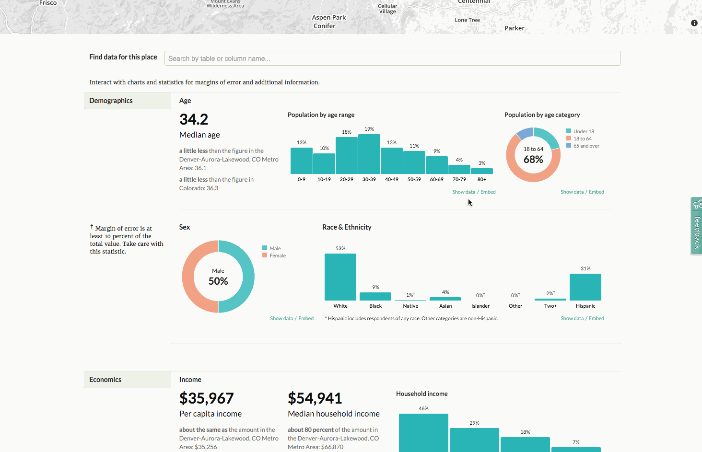

If you click "Show data" under any of the charts, a table pops open where you can see the numbers used in generating the charts, along with all the margins of error, and a dagger where the MOE is large. Another benefit of this chart is, if you have a small geography selected, it'll compare the selected geography with larger geographies, to give some context.

## Ways to use this info

### Provide context

No admin access, coding or special CMS skills required! Works in all media!

Use Census Reporter data to provide context in stories:

* If there's a new condo development going up in Denver, I can take less than five minutes to tell you that Denver's housing has a [median age of 1966](http://censusreporter.org/data/table/?table=B25035&geo_ids=16000US0820000&primary_geo_id=16000US0820000) and that only [3.1% of its housing has been built since 2010](http://censusreporter.org/data/table/?table=B25034&geo_ids=16000US0820000&primary_geo_id=16000US0820000).
* If after-school programs are being cut, I can tell you that [22% of Denver's kids live below the poverty line](http://censusreporter.org/profiles/16000US0820000-denver-co/#poverty).
* If there's a major new road construction project announced, I can tell you that [more than 60% of Denver's workers spend less than 30 minutes getting to work](http://censusreporter.org/data/table/?table=B08303&geo_ids=16000US0820000&primary_geo_id=16000US0820000), and [around 80% of them drive alone or in a carpool](http://censusreporter.org/data/table/?table=B08105A&geo_ids=16000US0820000&primary_geo_id=16000US0820000).

### Embed the data as a chart

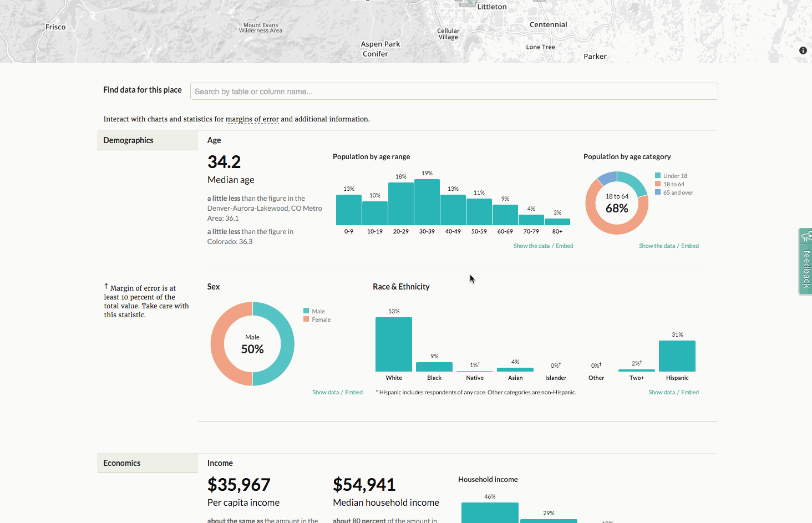

Census Reporter provides embed codes for charts on the place pages. This does require access to the HTML code of your posts, and a cooperative CMS — not a "helpful" one that tries to strip out HTML tags it doesn't like. If you've ever embedded a Tweet or a YouTube video, you might be able to embed a Census Reporter chart.

Just find the chart you're interested in, and click the "embed" link below it. You'll get a popup modal that allows you to select whether the graphic should be full-width in your story, or floated to the left or right. Then all you have to do is copy the HTML code and paste it into your CMS.

The embedded charts are responsive and interactive.

### Download the data
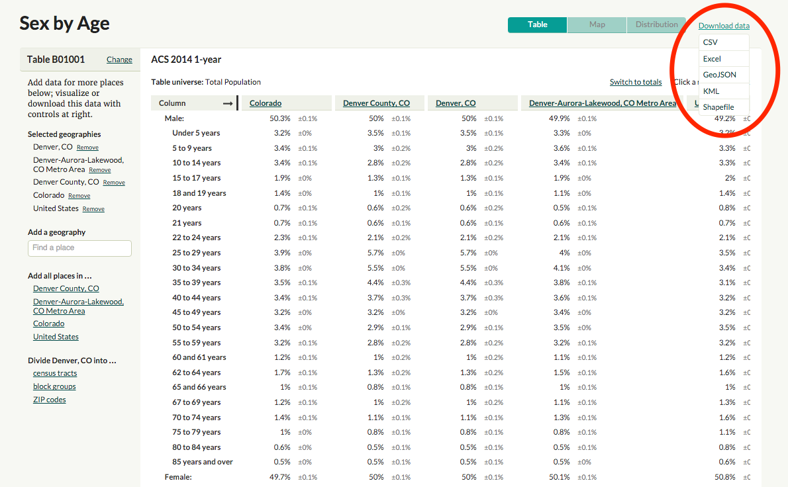

Finally, you can download the data from any chart or table to do further analysis or make custom visualizations. When you're looking at a table, just click the "Download data" button in the top right corner.

You can get the data as CSV or Excel for analysis or visualization, or GeoJSON, KML or Shapefile for mapping.

## More info

You can also find Census Reporter's [blog on Tumblr](http://censusreporter.tumblr.com/), [Tweets on Twitter](https://twitter.com/CensusReporter) and code on [GitHub](https://github.com/censusreporter/). Census Reporter also provides [an API](https://github.com/censusreporter/census-api/blob/master/API.md) to make grabbing Census data easier.

----------
# Interactive Tables Can Be Rad
*By Scott Pham*
An interactive table is one of the most basic kinds of interactives you can make. But they can be hella cool and are a good project to build skills with.
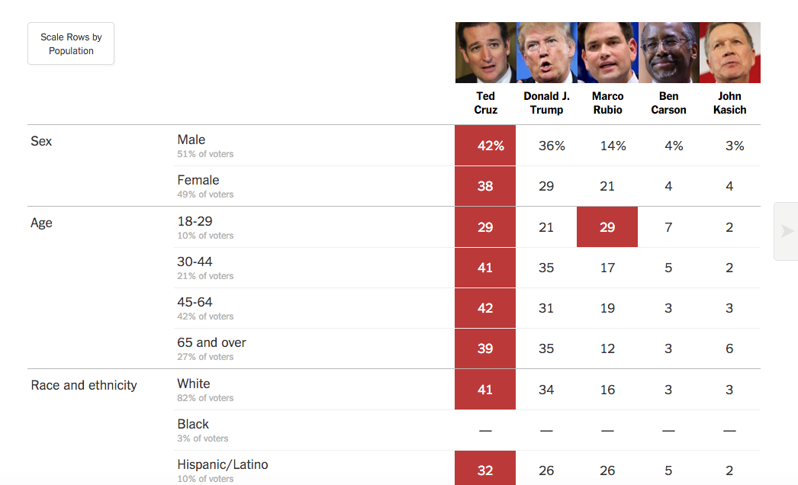
This recent NYTimes table showing polling data walks the line between a chart and a table, but that’s often when tables can really shine. This data would be awkward in bar chart form and would require a large amount of small-multiples. I think it works best as a humble table.

## Most data you encounter will be tabular
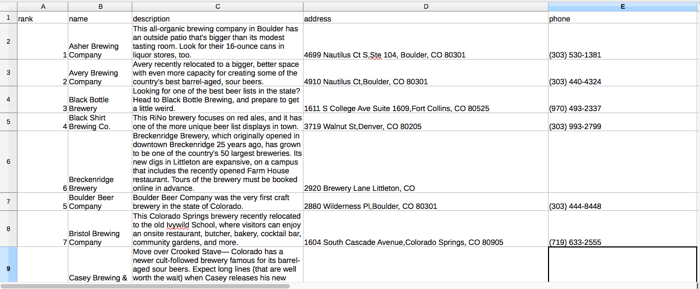
So a table is a natural place to start. Depending on your skill level, here's what you can do to improve your basic HTML table.

## Pretty it up
Easiest way to get started is [Bootstrap CSS](http://getbootstrap.com/css/). If you haven't used it before, Bootstrap is very useful for everything from basic layouts to interactive components like buttons and nav bars.
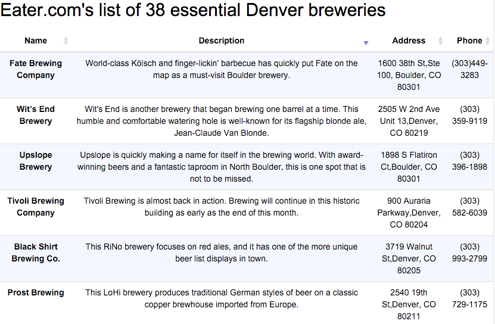
The css code for a basic bootstrap table is very simple:

## Make its sortable
Sorting is a fundamental programming concept, and it's not crazy to implement sorting yourself with jQuery or pure JavaScript. This [tutorial](http://code.tutsplus.com/tutorials/using-jquery-to-manipulate-and-filter-data--net-5351) on how to implement sorting and filtering is a bit old but the code is still useable.

[TSorter](tsorter http://www.terrill.ca/sorting/) is a really minimal library with pretty readable code. I used it on a recent project to do simple sorting of a small table.
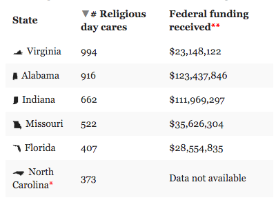

## Make it sortable *and* paginated
The [DataTables] (https://datatables.net/examples/basic_init/table_sorting.html) library is pretty hard to beat--it adds sorting, pagination and filtering to any table. A table that's too big to fit on one page becomes a dynamic, user-searchable database.

DataTables works best when you already have your table in HTML. If you don't, you can import that table from Google Docs with very little code. [Chris Keller’s Tabletop to Datatables](https://github.com/chrislkeller/_tabletop_to_datatables) repo is where I first started. [Lisa William’s Illustrated Guide](http://dataforradicals.com/the-absurdly-illustrated-guide-to-sortable-searchable-online-data-tables/) gives you a painstakingly step-by-step guide, guaranteeing that you'll be able to get this online. After going through those repos, I made my own [Tabletop to Datatables Fork](https://github.com/scottpham/tabletop-to-datatables),

## Part of your toolset
As you learn, you can find ways to include tables in your interactives. In this [recent interactive](LINK TK), I put a table alongside a map.
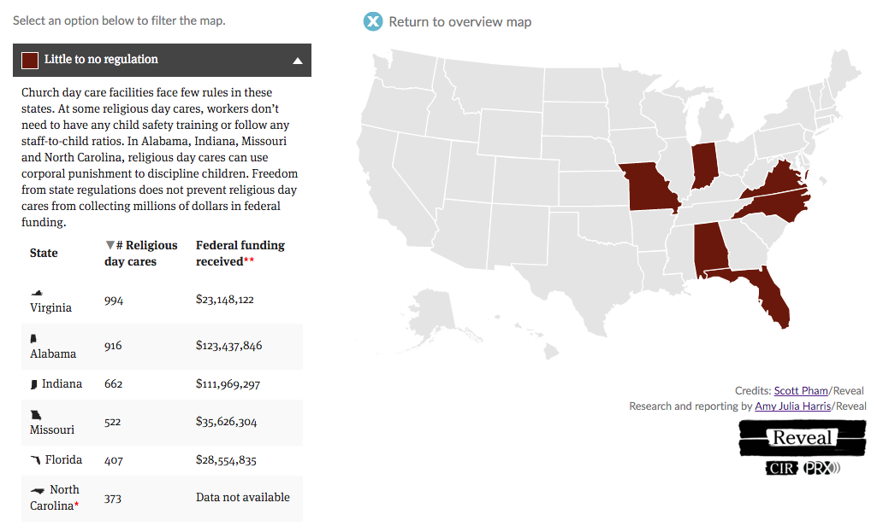
