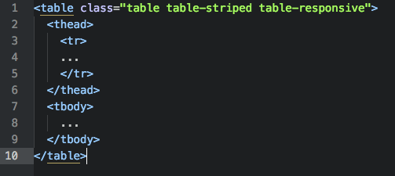
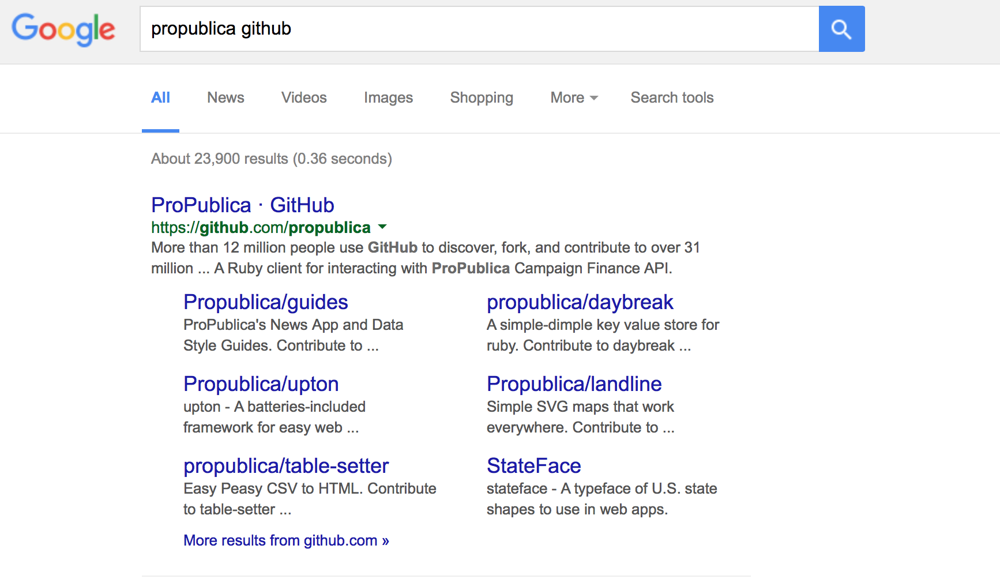
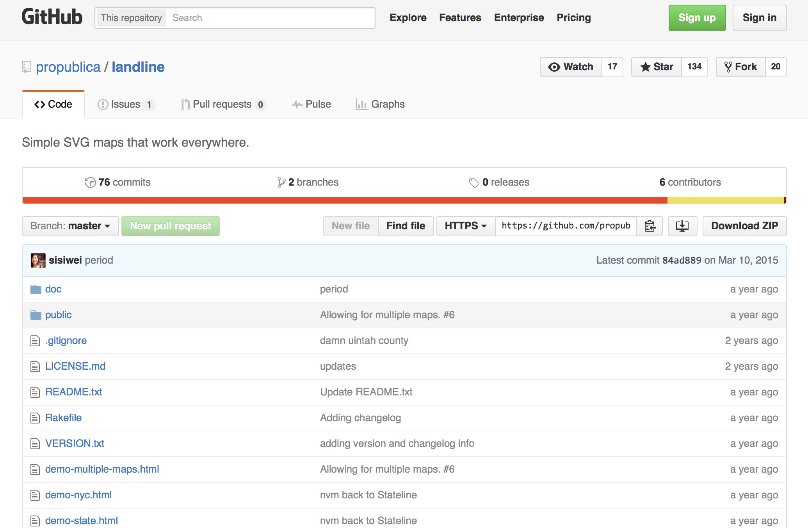

# NICAR16LCC
Tipsheet for the Lonely Coder Presentation at NICAR 2016 in Denver

## Original Session Description: So You Want to Be a Lonely Coder?

How do you transition from a journalist who does data stuff sometimes to a full-fledged coder in your newsroom and what happens when you do? This session will help you take your data skills to the next level by giving you easy-to-replicate projects and newsroom tools that involve minimal coding and can be done in most locations and beats. Panelists will take you through some “easy wins” for your newsroom and discuss their experiences navigating newsrooms as the only coder in the room, as well as how to get buy-in from your boss and to convince higher-ups of the extra value in these types of projects.

## Goals:
The goal is to provide some concrete examples and starting points on how to get started in the world of data journalism from a dead stop. The audience should leave with some story ideas, easy-to-pick up tools and some notion of a plan that will take him from software-user to coding-journalist.

By [Scott Pham](https://twitter.com/scottpham), [Brent Jones](https://twitter.com/brentajones), [Allie Kanik](https://twitter.com/act_rational), and [Lindsey Cook](https://twitter.com/Lindzcook)

# Intro
*By Scott Pham*

When I started out in data journalism, I felt a little lost. None of my immediate peers had any experience with data or code. It was hard to explain to others what I was trying to learn and do, and I didn't always have the tools or support I needed to do it.

I think that people who are learning data journalism on their own need to think hard about their strategy and their goals. Their newsroom may or may not be hospitable to data journalism and they need to find a way forward that works for their specific context.

A lonely coder needs to actively reach out for help and community because they aren't going to get it from their peers. We can't solve all of these problems with a tipsheet, but what we can do is provide some projects to get started from zero. Small wins build credibility and help you learn programming while staying productive in the newsroom.

If you are a lonely coder (or merely identify as one!) join the [Lonely Coders Club Slack group](http://lcc-slack.herokuapp.com/) or contact me at spham@cironline.org to get an invite. The group has more than a hundred coding journalists in newsrooms around the country. It's a good place to ask questions or show off some of your work.

*A note on code*: Not all data journalists code, but we've focused on coding because this tends to the be a big roadblock to solo data journalists. If you're on your own, your peers won't understand your code and might not get why its necessary or what it can do. These projects are designed to keep you productive and help you build on each success.

### Table of Contents:
- [CensusReporter.org](#census)
- [Interactive Tables](#tables)
- [Chartbuilder](#chartbuilder)
- [Github](#github)
- [Browser Developer Tools](#browser-tools)


# <a name="census"></a>[CensusReporter.org](http://censusreporter.org)

*By Brent Jones*

First stop for exploring U.S. Census and American Community Survey data.
Can give you basic facts about a place very quickly.
Or be a starting place for a deeper story.


## Ways to explore:

* By place search
* By topic search
* Guided topics

## Guided Topics
Found on the homepage, these topics explain Census and ACS tables and provide direct links to CensusReporter summaries for many tables.

* [Getting Started](http://censusreporter.org/topics/getting-started/)
* [Table Codes](http://censusreporter.org/topics/table-codes/)
* [Geography](http://censusreporter.org/topics/geography/)

These three are an introduction to the rest. Getting Started is a basic overview of the data. Table Codes serves as sort of codebook for deciphering what the codenumbers mean. Geography explains how the Census breaks down and denotes geography within tables.

* [Age and Sex](http://censusreporter.org/topics/age-sex/)
* [Children](http://censusreporter.org/topics/children/)
* [Commute](http://censusreporter.org/topics/commute/)
* [Employment](http://censusreporter.org/topics/employment/)
* [Families](http://censusreporter.org/topics/families/)
* [Health Insurance](http://censusreporter.org/topics/health-insurance/)
* [Income](http://censusreporter.org/topics/income/)
* [Migration](http://censusreporter.org/topics/migration/)
* [Poverty](http://censusreporter.org/topics/poverty/)
* [Public Assistance](http://censusreporter.org/topics/public-assistance/)
* [Race and Hispanic Origin](http://censusreporter.org/topics/race-hispanic/)
* [Same-sex Couples](http://censusreporter.org/topics/same-sex/)
* [Seniors](http://censusreporter.org/topics/seniors/)
* [Veterans and Military](http://censusreporter.org/topics/veterans/)

The rest of these describe the topics in more detail as well as list many tables that pertain to the topic. They're a great way to get started if you're just exploring data.

## Topic Search

Also available from the homepage is topic search. You can start typing words relating to tables that you're interested in, and a dropdown list will show you what's available.

### What you get


With either of these methods, you'll get a page describing the table. Helpfully, you'll get the universe of the table, to see who is included in the data. You'll also see the columns available. Off to the right are links to the topic pages that are relevant.

Most importantly, at the top is a box to pick the geographies you want to look at. You can either type a place name or a "summary level" — meaning a type of geography, like state, county, place, etc.

If you choose a summary level you'll also be asked to choose another, larger, summary level to filter the first choice by. An example: If you choose "places", you can then filter to choose places *in* Missouri, or places *in* St. Louis County.

#### The table view


Once you've chosen your places and clicked through, you'll get a table. Here's its anatomy:

* At the top, you have the dataset used (usually ACS, with 1-, 3- or 5-year noted)
* Below that, the table universe.
* Across the top of the table, in columns, you have the geographies you selected.
* Down the sides, you have the "columns" of categories in the table.
* The data, with margins of error, are in the appropriate spots.

A few tools are available to you on this page. On the left you can change what geographies you're looking at. At the top right, you can download the data into various formats, including GeoJSON or shapefiles.

Finally, in the green buttons near the top, you can view the data in two other ways: A map or a distribution.

#### Map view


If you check out the map view, you'll see a choropleth map of the geography selected. Rolling over the geographies triggers a tooltip with the information selected, as well as the margin of error. An info box gives you the same basic data as the table view.

You want to be careful here, making sure that the column selected under "Show Column" in the info box is the column you think it is.

You can also change how your geography is divided, or change which geography you're looking at by clicking the Add More Places button.

#### Distribution view


The distribution view is the final way to view the data. I found out that internally, some folks at Census Reporter call these "COAL" charts, for "circles-on-a-line".

You'll find the familiar bar at the left with options for changing the geography, and the data set used as well as the universe at the top.

For each column, there's a line with each geography represented as a circle. The Minimum, Median and Maximum are labeled. Rolling over the circles generates the tooltip, and you can click to lock the tooltip open, in order to compare more than one item.

## Place search


One simple way of using Census Reporter is by finding out information about a specific place. You can do this in the top search bar on the homepage, or the search bar in the top toolbar on most pages.

You can also click on the "search by address" button and let the site have access to your location (or just type in an address). This method lets you choose any of the geographies your address fits into: from block group to state, division or region.

Once you've chosen a place, you'll see a map at the top of the page showing the boundaries of the area. There's an info box with basic information about the place. Also important, the info box tells which data set is used.


Below that, there's a box to jump to a specific table.

After that is a series of charts:

* Demographics
* Economics
* Families
* Housing
* Social

The charts note where the margins of error are large (and therefore where you should be careful using the data). You can roll over most areas on the charts to show more information.

The charts each have two links under them: Show data, and Embed.

### Show data


If you click "Show data" under any of the charts, a table pops open where you can see the numbers used in generating the charts, along with all the margins of error, and a dagger where the MOE is large. Another benefit of this chart is, if you have a small geography selected, it'll compare the selected geography with larger geographies, to give some context.

## Ways to use this info

### Provide context

No admin access, coding or special CMS skills required! Works in all media!

Use Census Reporter data to provide context in stories:

* If there's a new condo development going up in Denver, I can take less than five minutes to tell you that Denver's housing has a [median age of 1966](http://censusreporter.org/data/table/?table=B25035&geo_ids=16000US0820000&primary_geo_id=16000US0820000) and that only [3.1% of its housing has been built since 2010](http://censusreporter.org/data/table/?table=B25034&geo_ids=16000US0820000&primary_geo_id=16000US0820000).
* If after-school programs are being cut, I can tell you that [22% of Denver's kids live below the poverty line](http://censusreporter.org/profiles/16000US0820000-denver-co/#poverty).
* If there's a major new road construction project announced, I can tell you that [more than 60% of Denver's workers spend less than 30 minutes getting to work](http://censusreporter.org/data/table/?table=B08303&geo_ids=16000US0820000&primary_geo_id=16000US0820000), and [around 80% of them drive alone or in a carpool](http://censusreporter.org/data/table/?table=B08105A&geo_ids=16000US0820000&primary_geo_id=16000US0820000).


### Embed the data as a chart


Census Reporter provides embed codes for charts on the place pages. This does require access to the HTML code of your posts, and a cooperative CMS — not a "helpful" one that tries to strip out HTML tags it doesn't like. If you've ever embedded a Tweet or a YouTube video, you might be able to embed a Census Reporter chart.

Just find the chart you're interested in, and click the "embed" link below it. You'll get a popup modal that allows you to select whether the graphic should be full-width in your story, or floated to the left or right. Then all you have to do is copy the HTML code and paste it into your CMS.

The embedded charts are responsive and interactive.

### Download the data


Finally, you can download the data from any chart or table to do further analysis or make custom visualizations. When you're looking at a table, just click the "Download data" button in the top right corner.

You can get the data as CSV or Excel for analysis or visualization, or GeoJSON, KML or Shapefile for mapping.

## More info

You can also find Census Reporter's [blog on Tumblr](http://censusreporter.tumblr.com/), [Tweets on Twitter](https://twitter.com/CensusReporter) and code on [GitHub](https://github.com/censusreporter/). Census Reporter also provides [an API](https://github.com/censusreporter/census-api/blob/master/API.md) to make grabbing Census data easier.

----------
# <a name="table"></a>Interactive Tables Can Be Rad
*By Scott Pham*
An interactive table is one of the most basic kinds of interactives you can make. But they can be hella cool and are a good project to build skills with.

This recent NYTimes table showing polling data walks the line between a chart and a table, but that’s often when tables can really shine. This data would be awkward in bar chart form and would require a large amount of small-multiples. I think it works best as a humble table.

## Most data you encounter will be tabular

So a table is a natural place to start. Depending on your skill level, here's what you can do to improve your basic HTML table.

## Pretty it up
Easiest way to get started is [Bootstrap CSS](http://getbootstrap.com/css/). If you haven't used it before, Bootstrap is very useful for everything from basic layouts to interactive components like buttons and nav bars.

The css code for a basic bootstrap table is very simple:


## Make its sortable
Sorting is a fundamental programming concept, and it's not crazy to implement sorting yourself with jQuery or pure JavaScript. This [tutorial](http://code.tutsplus.com/tutorials/using-jquery-to-manipulate-and-filter-data--net-5351) on how to implement sorting and filtering is a bit old but the code is still useable.

[TSorter](tsorter http://www.terrill.ca/sorting/) is a really minimal library with pretty readable code. I used it on a recent project to do simple sorting of a small table.


## Make it sortable *and* paginated
The [DataTables] (https://datatables.net/examples/basic_init/table_sorting.html) library is pretty hard to beat--it adds sorting, pagination and filtering to any table. A table that's too big to fit on one page becomes a dynamic, user-searchable database.

DataTables works best when you already have your table in HTML. If you don't, you can import that table from Google Docs with very little code. [Chris Keller’s Tabletop to Datatables](https://github.com/chrislkeller/_tabletop_to_datatables) repo is where I first started. [Lisa William’s Illustrated Guide](http://dataforradicals.com/the-absurdly-illustrated-guide-to-sortable-searchable-online-data-tables/) gives you a painstakingly step-by-step guide, guaranteeing that you'll be able to get this online. After going through those repos, I made my own [Tabletop to Datatables Fork](https://github.com/scottpham/tabletop-to-datatables),

## Part of your toolset
As you learn, you can find ways to include tables in your interactives. In this [recent interactive](LINK TK), I put a table alongside a map.


# <a name="chartbuilder"></a>Chartbuilder

*By Lindsey Cook*

Chartbuilder is a powerful open source charting tool from the team at Quartz. The tool can be customized easily with your newsroom's fonts, colors and logo and then hosted for free on Github. See what it looks like on Quartz's repo [here](https://quartz.github.io/Chartbuilder/).

This tutorial is a beginner version of the docs provided by [Quartz](https://github.com/Quartz/Chartbuilder) and the [awesome tutorial](https://github.com/golfecholima/Chartbuilder/blob/master/docs/MakingChartbuilderYours.md) by [George LeVines](https://twitter.com/rhymeswthgeorge).

## Getting Setup

1. Download and install [Node](https://nodejs.org/en/download/)
2. Download Chartbuilder via [Quartz’s Github](https://github.com/Quartz/Chartbuilder/archive/master.zip)
3. Locate the folder and unzip it
4. (Mac) Open the terminal -- this application comes with your computer and can be found in your Applications folder
5. Type cd ~/Downloads/Chartbuilder-master/ to navigate to inside the folder
6. Install the dependencies automatically by typing npm install (if a prompt comes up to install developer tools, allow it)
7. When that is finished (it could take several minutes) type npm run dev
8. When you see “serving files from: build” visit http://localhost:3000/ in your browser. You should see a version of Chartbuilder

## Typography

1. In your finder, go to Chartbuilder/src and create a new folder called fonts.
2. Find your font on Google fonts and download it. I’m using [Roboto](https://www.google.com/fonts#UsePlace:use/Collection:Roboto) and downloading the light, medium and bold.
3. Unzip and move the folder inside your fonts folder
4. Open Chartbuilder/src/styl/fonts.styl in a text editor ([I use Sublime Text](https://www.sublimetext.com/)) and delete what’s in there currently. Replace with the following for your fonts:

```
@font-face {
font-family: 'Roboto';
font-style: normal;
font-weight: 400;
src: url('/fonts/Roboto/Roboto-Regular.ttf');
}

@font-face {
font-family: 'Roboto-Bold';
font-style: bold;
font-weight: 700;
src: url('/fonts/Roboto/Roboto-Bold.ttf');
}

@font-face {
font-family: 'Roboto-Light';
font-style: normal;
font-weight: 300;
src: url('/fonts/Roboto/Roboto-Light.ttf');
}
```

Open Chartbuilder/src/styl/type.styl and use your new fonts. I have this:

```

// Typography

// Fonts
$font-sans = 'Roboto',Helvetica,sans-serif
$font-sans-light = 'Roboto-Light',Helvetica,sans-serif
$font-sans-bold = 'Roboto-Bold', Helvetica, sans-serif
$font-serif = Georgia,serif
$primary-font-family = $font-sans
$secondary-font-family = $font-serif
$monospaced-font-family = Monaco, Lucida Console, monspace

```

Save.

If you go back to your Chartbuilder in your browser, your new fonts will be there.

You may need to restart the version of Chartbuilder in your browser. You can do that at any time by typing npm run dev

## Colors

Open Chartbuilder/src/styl/colors.styl in your text editor and find $chart-colors. You can swap out these colors for the colors on your website. Just don’t add more than the 11 that are already there. If you want to add more, see George's tutorial for more information on how.

These are mine:

```
$chart-colors = \
	#c0ddf2 \
	#2262bb \
	#13325d \
	#ffc14e \
	#d1453d \
	#e38d13 \
	#ade8e0 \
	#0abba4 \
	#037b6b \
	#666 \
	#999

```

## Add Your Logo

Add your logo to src/assets and name it logo.png

Open Chartbuilder/src/js/components/svg/ChartFooter.jsx

Make the changes outlined [here.](https://github.com/golfecholima/Chartbuilder/commit/4606247b7d3931f362c037f11eb718edfea6a601)

Next, create the file SvgImage.jsx in Chartbuilder/src/js/components/svg/. Add the following contents to that file:

```
// Svg image elements used to annotate chart
var React = require("react");
var PropTypes = React.PropTypes;
var ChartViewActions = require("../../actions/ChartViewActions");

/**
 * An Svg <image> element with width and height
 * @instance
 * @memberof RendererWrapper
 */
var SvgImage = React.createClass({

    propTypes: {
        className: PropTypes.string,
        onUpdate: PropTypes.func,
        translate: PropTypes.array.isRequired,
        url: PropTypes.string.isRequired
    },

    render: function() {
        var imgNodes;

            imgNodes = (
                <svg dangerouslySetInnerHTML={{__html: "<image xlink:href='" + this.props.url +
                 "' width='" + this.props.width +
                 "' height='" + this.props.height +
                 "'/>" }} />
            )

        return (
            <g
                className={["svg-img", this.props.className].join(" ")}
                transform={"translate(" + this.props.translate + ")"}
            >
                {imgNodes}
            </g>
        );
    }

});

module.exports = SvgImage;

```
Save.
Check out your chart with the logo.

Depending on how big you want your logo to look, you may need to tweak the code in the Chartbuilder/src/js/components/svg/ChartFooter.jsx file.

For my version, I ended up with the following on line 101. (This is 30 on George’s tutorial)

```
translate={[this.props.translate.left +110, this.props.translate.bottom - this.props.extraHeight]}

```

And with the following on line 139:

```

configCreditImg.logowidth = 100;
configCreditImg.logoheight = 30;

```

George had 25 and 25.

For even more customization, see [George’s tutorial](https://github.com/golfecholima/Chartbuilder/blob/master/docs/MakingChartbuilderYours.md) and the [chartbuilder docs.](https://github.com/Quartz/Chartbuilder/tree/master/docs)

When you are done making adjustments, you’re ready to deploy.

## Deploying

Type npm run build into your terminal window. Note, you can create a new tab with apple + t.

Copy all the contents of the build folder (which is inside chartbuilder) into a new folder outside of chartbuilder named MyChartbuilder.

Go to your github profile on the github website. Click repositories and click new to create a new repo for your version of Chartbuilder. Name it MyChartbuilder.

Navigate to your folder using the command line. I saved mine on the desktop so in a new window type cd Desktop/MyChartbuilder

Then run the following commands

```
echo "# MyChartbuilder" >> README.md
git init
git add *
git commit -m "first commit"
```

Then type the following, but use your own URL (also on the Github page on the website).

```
git remote add origin https://github.com/lindzcook/Chartbuilder25.git
git push -u origin master
```

If you have never used Github on your computer, it will prompt for your username and password. Note, your password won’t show up as typed characters so it will look like nothing is happening when you are typing. That’s ok.

You should now see your code in your repo on the Github website. Here’s [mine.](https://github.com/lindzcook/Chartbuilder25)

Now let’s create a new branch. On the website, click Branch:master and type gh-pages where it says Find or create a branch…


This will create what will become your live website.

It may take a few mins, but your site will be live at http://username.github.io/MyChartbuilder

See mine here: [http://lindseycook.io/Chartbuilder25/](http://lindseycook.io/Chartbuilder25/)

Happy charting!


# Lonely Coders Cocktail

*By Alexandra Kanik*

As a lonely coder, it's important to have an arsenal of tools that help you find and troubleshoot projects and code. Here are some of the more useful tools that I and my piers use to accomplish these goals:

- github
- browser developer tools
- LCC/NICAR-L
- Google

## <a name="github"></a>[Github](http://github.com)

If you don't have a Github account already, [sign up here](https://github.com/join?source=header-home).

Github is both a version control system and a platform for hosting and sharing code. The ideal situation is that you use Github as *both* a version control system and a way to discover and share code. But it's important not to get hung up on the fact that you don't know how to use Github as a version control system. That part is a little tricky especially if you're not using it on a daily basis.

### Using Github to find coding projects

If you visit the [Github Explore page](https://github.com/explore), you'll see the vastness of the Github network. Many organizations (including news orgs) are posting their code on Github in an effort to enhance transparency and to facilitate sharing and co-development.

You can also perform a Google search for your favorite news organizations' Github accounts to see what kind of data projects they've posted there. For example:



### Using Github to 'Frankenstein' working projects

It's important to note that not every project you find on Github is going to be a quality project. Some projects posted on Github are incomplete or broken and will likely cause you more problems than they're worth.

Larger news organizations like [ProPublic](https://github.com/propublica), [LA Times](https://github.com/datadesk), and [Quartz](https://github.com/Quartz) usually don't post code projects that are broken or incomplete. And if they are, that fact will be noted in the README.md file available when you first view a projects, or repository.

You may be wondering what the term 'Frankenstein' means in relationship to code. Frankensteining is when you take someone else's code and manipulate it so that it suites your specific needs.

The reason that Github is so useful in this Frankensteining process is because you can 'pull' the code that exists on the Github website down to your personal computer and mess around with it to your hearts content!

If you completely destroy the code beyond repair, you can simply delete your local version of the code, pull a fresh version of the code from Github, and start again.

NOTE: This is actually where the version control system part comes in. If you're using Github to your full advantage and you completely destroy the code that you're working on, you shouldn't need to delete all of the work you've done. Git should allow you to roll back to a previous change that isn't so bad.

Here are some steps involved in pulling a repository to your local machine and Frankensteining it:


- If you don't have a Github account already, [sign up here](https://github.com/join?source=header-home).
- Github is available as a [GUI desktop application](https://desktop.github.com) or via the command line. I personally find the GUI version harder to understand than the command line version, so this example will use the command line. If you don't know how to use the command line I strongly suggest investing some time in it because it will make most projects you try to work on much easier and more logical.
- If you're also unfamiliar with using git via command line, [here's a useful resource](https://help.github.com/articles/set-up-git/).
- Visit a Github repository that you'd like to play around with. We'll us [Propublica's Landline repository](https://github.com/propublica/landline) for this demo.

- Grab the link that's available in the *https* field.
- Create a local copy of the repository

- Read the README.md or README.txt file for documentation on how to use the project.
- Mess around to your hearts content.

## <a name="browser-tools"></a>Browser Developer Tools

Browser developer tools are some of the strongest diagnostic tools that you’ll come across when trying to fix web-based issues. Browser developer tools are also a great way to get a look at dynamically-generated CMS code so you can manipulate it with CSS or javascript.


## LCC/NICAR-L

Joining online coder communities is essential if you’re trying to go it alone.

When you’re on deadline and you’re just not understanding the problems you’re up against, it’s invaluable to know that you’ve got a support system of more experienced coders.

You can and should also use these communities as a way of sharing ideas and expanding your knowledge of how others are solving data journalism problems with code.

- [LCC sign up](http://lcc-slack.herokuapp.com/)
- [NICAR-L sign up](https://www.ire.org/resource-center/listservs/subscribe-nicar-l)


## Let me Google that for you...

Learn how to ask the Google questions. Not all questions are created equal. Having good google skills will save you a lot of time when trying to find answers to questions that you’re pretty sure others have had. I’m pretty close to believing that there are no issues that Google can’t find an answer to.


